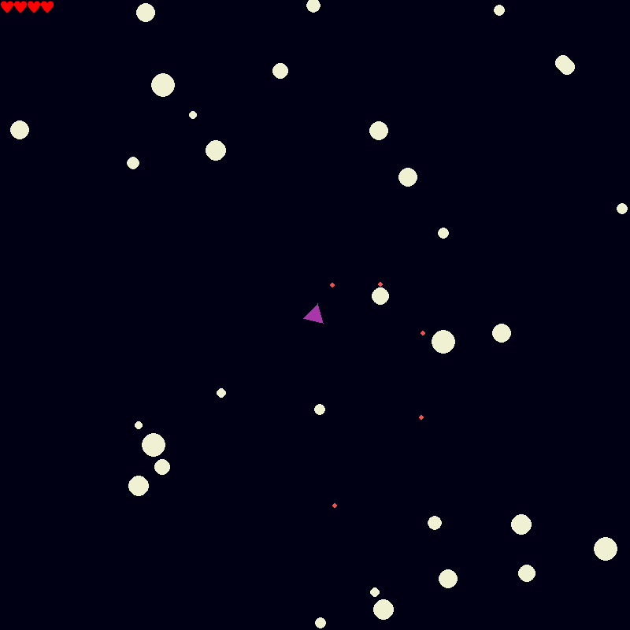

# Asteroids
Реализация на языке Python геймплея игры для аркадных автоматов "Астероиды".
Реализован поиск столкновений на основе квадродеревьев.

### Требуемые модули Python
```pygame```  
```pygame-menu```  

### Управление
```W``` - Движение вперёд  
```A``` - Поворот влево  
```D``` - Поворот вправо  
```SPACE``` - Выстрел  
```F``` - Отображение квадрантов  

### Изображение игрового процесса

